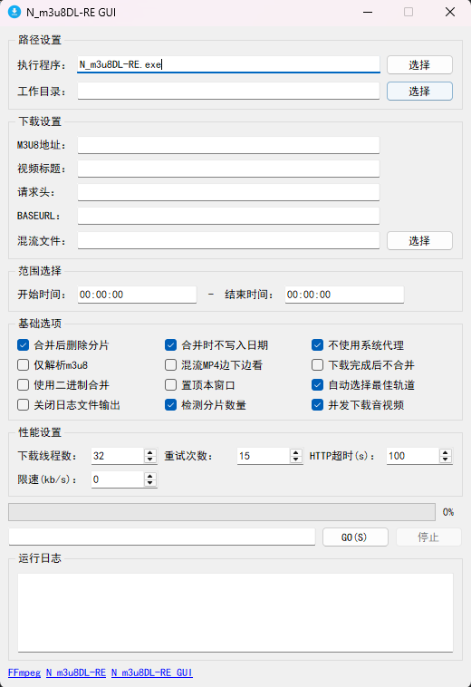

# N_m3u8DL-RE GUI

这是一个基于PyQt5开发的M3U8流媒体下载工具的图形界面版本，为命令行工具[N_m3u8DL-RE](https://github.com/nilaoda/N_m3u8DL-RE/releases)提供了友好的用户操作界面，简化了M3U8文件的下载和处理流程。

## 功能特点

### 基础功能
- 支持输入M3U8链接或本地文件路径进行下载
- 可自定义保存目录和文件名
- 支持设置请求头、BASEURL等参数
- 提供下载进度实时显示
- 支持中断正在进行的下载任务
- 详细的日志输出，便于问题排查

### 高级功能
- **性能设置**：可调整下载线程数、重试次数、HTTP超时和下载限速
- **字幕处理**：支持字幕下载、格式选择(SRT/VTT)和自动修正
- **解密功能**：支持自定义密钥和解密引擎(MP4DECRYPT/FFMPEG/SHAKA_PACKAGER)
- **代理设置**：支持使用系统代理或自定义HTTP代理
- **范围选择**：可指定下载视频的时间段
- **混流功能**：支持边下边看和合并外部媒体文件
- **并发下载**：支持并发下载音频、视频和字幕，提高下载速度

## 界面预览



程序界面简洁直观，主要包含以下几个部分：
- **路径设置**：设置执行程序路径和工作目录
- **下载设置**：输入M3U8地址、视频标题、请求头等
- **范围选择**：设置下载的时间段
- **基础选项**：提供常用的下载选项勾选
- **性能设置**：调整下载性能相关参数
- **进度条**：显示下载进度
- **命令显示**：显示当前执行的命令行
- **控制按钮**：开始下载和停止下载
- **运行日志**：显示程序运行过程中的详细日志

## 安装方法

### 环境准备
1. 确保已安装Python 3.x
2. 安装所需的依赖包：
   ```bash
   pip install -r requirements.txt
   ```
3. 启动程序：
   ```bash
   python app.py
   ```

### 必要组件
1. **N_m3u8DL-RE**：核心下载引擎，可从[官方GitHub仓库](https://github.com/nilaoda/N_m3u8DL-RE/releases)下载最新版本
2. **FFmpeg**：用于媒体文件的合并和处理，需从[官方网站](https://ffmpeg.org/download.html)下载并确保可访问

## 使用说明

### 基本使用
1. 确保N_m3u8DL-RE.exe位于程序同级目录或在路径设置中指定正确路径
2. 输入M3U8地址或选择本地M3U8文件
3. 填写视频标题（可选）
4. 选择保存目录（可选）
5. 点击"GO(S)"按钮开始下载
6. 可通过"停止"按钮中断下载

### 高级配置
- **请求头设置**：多个请求头用分号(;)分隔，如 `Cookie: xxx;User-Agent: xxx`
- **范围选择**：格式为 `HH:MM:SS-HH:MM:SS`，如 `00:05:30-00:15:45`
- **字幕设置**：可选择只下载字幕、设置字幕格式和是否自动修正
- **代理设置**：支持HTTP代理，格式为 `http://127.0.0.1:8888`
- **性能调优**：根据网络情况调整线程数、重试次数等参数

## 常见问题

### 1. 下载失败怎么办？
- 检查M3U8链接是否有效
- 检查网络连接是否正常
- 查看日志输出了解具体错误信息
- 尝试调整请求头、代理设置等参数

### 2. 如何提高下载速度？
- 增加下载线程数（性能设置中的"下载线程数"）
- 启用"并发下载音视频"选项
- 确保网络连接稳定

### 3. 下载的视频没有声音/字幕？
- 启用"自动选择最佳轨道"选项
- 检查是否有选择正确的音视频轨道
- 确保字幕选项正确设置

### 4. 程序无法启动？
- 确保已安装Python和所有依赖包
- 确保N_m3u8DL-RE文件存在且可执行
- 检查是否有足够的系统权限

## 打包成可执行文件

如果需要将程序打包成单个可执行文件，可使用PyInstaller：

```bash
pyinstaller --onefile --windowed --icon=favicon.ico app.py
```

打包后的可执行文件将位于`dist`目录中。

## 注意事项
1. 请确保遵守相关法律法规，仅用于下载合法授权的内容
2. 下载受版权保护的内容可能违反相关法律法规
3. 程序仅提供技术工具，使用者需自行承担使用责任
4. 对于加密的M3U8流，可能需要提供正确的密钥才能下载

## 致谢

本程序基于以下开源项目开发：
- [N_m3u8DL-RE](https://github.com/nilaoda/N_m3u8DL-RE) - M3U8下载核心引擎
- [FFmpeg](https://ffmpeg.org/) - 媒体处理工具
- [PyQt5](https://pypi.org/project/PyQt5/) - GUI框架

## 更新日志

### 最新版本
- 修复了进度条解析的问题
- 优化了命令显示功能
- 添加了自动选择最佳轨道的默认选项
- 更新了相关链接显示

## 联系方式

如有问题或建议，欢迎提交Issue或Pull Request。
